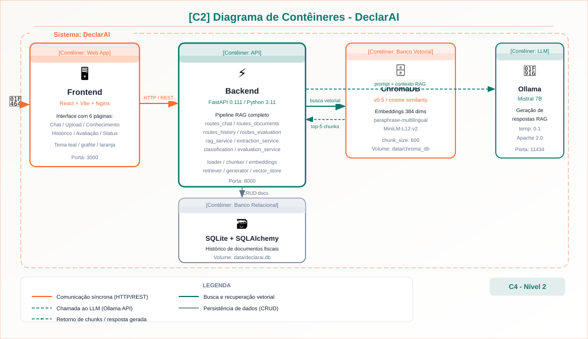
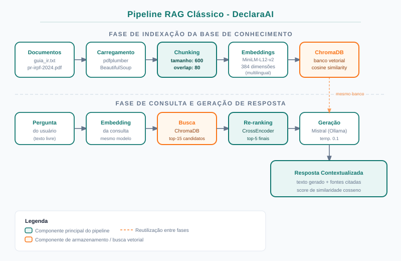
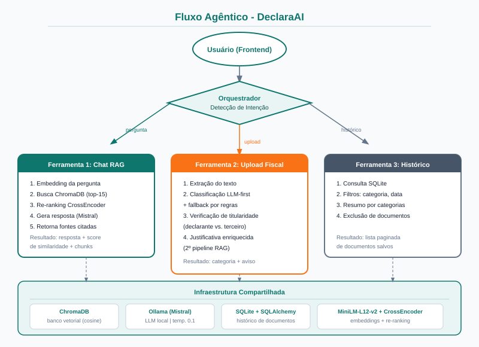
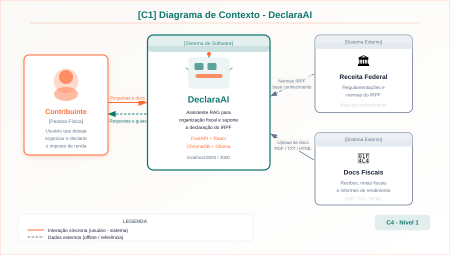

<p align="center">
  
</p>

<p align="center">
  Assistente inteligente com <strong>Agentic RAG</strong> para organização de documentos e apoio à declaração do imposto de renda pessoa física.<br>
  <em>Projeto Acadêmico - UEA • Oficina e Desenvolvimento de Sistemas I</em>
</p>

---

<h2 align="center">Tecnologias Utilizadas</h2>

<p align="center">
  
  
  
  
  
  
  
  
</p>

---

<h2 align="center">Descrição do Projeto</h2>

O **DeclarAI** é um Micro SaaS acadêmico com pipeline **Agentic RAG** que auxilia contribuintes na organização de documentos fiscais e na compreensão das regras do IRPF. O agente escolhe ferramentas conforme a intenção do usuário: busca semântica, classificação tributária com LLM-first, verificação de titularidade, justificativa enriquecida por RAG e consulta ao histórico.

O sistema não substitui a orientação profissional de um contador. Toda a execução ocorre localmente via Ollama, garantindo privacidade dos dados fiscais e conformidade com a LGPD.

---

<h2 align="center">Funcionalidades</h2>

| Funcionalidade | Descrição |
|---|---|
| **Chat RAG** | Perguntas em linguagem natural respondidas com base na base de conhecimento fiscal |
| **Upload fiscal** | Processamento de PDF, TXT, HTML, XML, JPG e PNG com extração automática |
| **Classificação LLM-first** | Mistral classifica a categoria tributária; fallback por regras se necessário |
| **Verificação de titularidade** | Identifica se o beneficiário é o declarante, dependente provável ou terceiro |
| **Justificativa enriquecida** | Segundo pipeline RAG gera explicação fundamentada na base de conhecimento |
| **Base de Conhecimento** | Adicionar, remover e re-indexar documentos de referência pela interface |
| **Histórico** | Armazenamento com filtros por categoria, nome e período |
| **Resumo anual** | Totais por categoria e economia estimada para a declaração |
| **Avaliação RAG** | Métricas quantitativas de recuperação e cobertura, com e sem LLM |
| **Status do sistema** | Disponibilidade do Ollama, modelos carregados e chunks indexados |

---

<h2 align="center">Arquitetura</h2>

<p align="center">
  
</p>

```text
Usuário
  |
Frontend React + Vite
  |
API FastAPI
  |
  +-- Chat RAG
  |     +-- Retriever semântico (ChromaDB)
  |     +-- Re-ranking com CrossEncoder multilíngue
  |     +-- Ollama com Mistral
  |
  +-- Upload de documentos
  |     +-- Extração por tipo de arquivo
  |     +-- Classificação LLM-first + fallback por regras
  |     +-- Verificação de titularidade
  |     +-- Justificativa enriquecida por RAG
  |
  +-- Histórico e resumo anual (SQLite)
```

---

<h2 align="center">Pipeline RAG</h2>

<p align="center">
  
</p>

### Decisões Técnicas Justificadas

| Decisão | Justificativa |
|---|---|
| **chunk_size = 600 chars** | Preserva regras fiscais completas sem diluir a similaridade semântica |
| **overlap = 80 chars** | Mantém continuidade entre fragmentos adjacentes; 7 configurações foram avaliadas |
| **paraphrase-multilingual-MiniLM-L12-v2** | Suporte nativo ao português, 384 dims, leve para CPU |
| **CrossEncoder multilíngue** | Re-ranking preciso em perguntas com negações e exceções fiscais |
| **Mistral via Ollama** | Maior cobertura (72,4%) entre os 4 modelos avaliados; licença aberta |
| **Execução local (Ollama)** | Dados fiscais sensíveis não saem do ambiente do usuário; conformidade com LGPD |
| **temperatura baixa** | Respostas conservadoras e precisas em domínio fiscal com regras específicas |
| **SQLite** | Zero configuração; suficiente para protótipo local sem dados distribuídos |

---

<h2 align="center">Fluxo Agêntico</h2>

<p align="center">
  
</p>

### Ferramentas do Agente

| Ferramenta | Quando é usada |
|---|---|
| `busca_vetorial` | Perguntas abertas sobre regras do IRPF |
| `busca_documento_usuario` | Perguntas sobre documentos enviados |
| `classificar_documento` | Upload de um novo documento |
| `verificar_titularidade` | Checagem de titular ou dependente |
| `gerar_justificativa` | Explicação fundamentada após classificação |
| `consulta_banco_dados` | Histórico, resumo anual e totais por categoria |

---

<h2 align="center">Base de Conhecimento</h2>

| Arquivo | Tipo | Relevância |
|---|---|---|
| `data/knowledge_base/guia_imposto_renda.txt` | TXT | Regras resumidas de obrigatoriedade, deduções e documentos |
| `data/knowledge_base/pr-irpf-2024.pdf` | PDF | Perguntas e respostas oficiais da Receita Federal |

Esses documentos cobrem despesas médicas, educação, previdência privada, rendimentos, dependentes, aluguéis, prazos, penalidades e documentos fiscais. A base pode ser ampliada pela interface em **Base de Conhecimento**.

---

<h2 align="center">Como Executar com Docker</h2>

```bash
docker compose up -d --build
docker exec -it declarai-ollama ollama pull mistral
```

| Serviço | URL |
|---|---|
| Frontend | http://localhost:3000 |
| API FastAPI | http://localhost:8000 |
| Swagger | http://localhost:8000/docs |
| Ollama | http://localhost:11434 |

---

<h2 align="center">Como Executar Localmente (sem Docker)</h2>

### Backend

```bash
cd backend
python -m venv .venv
source .venv/bin/activate
pip install -r requirements.txt
uvicorn app.main:app --reload --host 0.0.0.0 --port 8000
```

### Frontend

```bash
cd frontend
npm install
npm run dev
```

### Ollama

```bash
ollama serve
ollama pull mistral
```

---

<h2 align="center">API REST</h2>

A documentação interativa completa está disponível em `http://localhost:8000/docs` (Swagger UI).

### Chat RAG

| Método | Endpoint | Descrição |
|---|---|---|
| `POST` | `/chat` | Enviar pergunta ao assistente |
| `POST` | `/ingest` | Re-indexar base de conhecimento |
| `GET` | `/status` | Status e métricas do sistema |

### Documentos

| Método | Endpoint | Descrição |
|---|---|---|
| `POST` | `/documents/upload` | Upload e processamento fiscal |
| `POST` | `/documents/save` | Salvar documento no histórico |

### Declarante

| Método | Endpoint | Descrição |
|---|---|---|
| `POST` | `/declarante/perfil` | Registrar nome e CPF do declarante |
| `GET` | `/declarante/perfil` | Consultar perfil registrado |
| `POST` | `/declarante/verificar-titularidade` | Verificar titular ou dependente |

### Base de Conhecimento

| Método | Endpoint | Descrição |
|---|---|---|
| `GET` | `/knowledge/files` | Listar arquivos e total de chunks |
| `POST` | `/knowledge/upload` | Adicionar arquivo e re-indexar |
| `DELETE` | `/knowledge/files/{nome}` | Remover arquivo e re-indexar |
| `POST` | `/knowledge/reindex` | Re-indexar com configuração de chunking |

### Histórico

| Método | Endpoint | Descrição |
|---|---|---|
| `GET` | `/history` | Listar histórico com filtros |
| `GET` | `/history/summary` | Resumo anual por categoria |
| `DELETE` | `/history/{id}` | Excluir documento do histórico |

### Avaliação

| Método | Endpoint | Descrição |
|---|---|---|
| `POST` | `/evaluation/recuperacao` | Avaliar recuperação (sem LLM) |
| `POST` | `/evaluation/recuperacao-pergunta` | Avaliar uma pergunta isolada |
| `POST` | `/evaluation/completa` | Avaliar pipeline completo (com LLM) |
| `GET` | `/evaluation/casos-teste` | Listar perguntas anotadas |

### Exemplos de uso

```bash
# Chat
curl -X POST http://localhost:8000/chat \
  -H "Content-Type: application/json" \
  -d '{"pergunta": "Quais despesas médicas posso deduzir no IR?"}'

# Upload de documento
curl -X POST http://localhost:8000/documents/upload \
  -F "arquivo=@recibo_medico.pdf"

# Avaliação de recuperação
curl -X POST http://localhost:8000/evaluation/recuperacao
```

---

<h2 align="center">Avaliação da Solução</h2>

O dataset `data/eval/perguntas.json` possui 60 perguntas anotadas com resposta de referência, palavras-chave esperadas e nível de dificuldade, distribuídas em 12 categorias fiscais.

### Métricas implementadas

| Métrica | Descrição | Endpoint |
|---|---|---|
| **Taxa de Recuperação** | Perguntas com ao menos 1 chunk recuperado | `/evaluation/recuperacao` |
| **Score Médio de Contexto** | Similaridade cosseno média dos chunks retornados | `/evaluation/recuperacao` |
| **Cobertura de Keywords** | Termos esperados encontrados na resposta gerada | `/evaluation/completa` |
| **Latência por pergunta** | Tempo médio do pipeline completo | ambos |

### Comparação de modelos

| Modelo | Cobertura (%) | Latência (s) | Observação |
|---|---|---|---|
| Mistral + RAG | 72,4 | 8,2 | Melhor cobertura; modelo padrão |
| Phi-4 Mini + RAG | 68,3 | 7,0 | Boa relação tamanho/qualidade |
| Llama 3.2:3b + RAG | 65,8 | 6,4 | Mais leve |
| Gemma 3:4b + RAG | 61,2 | 6,9 | Menor cobertura no domínio fiscal |
| Mistral sem RAG | 44,1 | 5,1 | Ablation study; confirma o RAG |

O RAG contribui com +28,3 pontos percentuais em comparação com o LLM sem recuperação.

### Scripts de avaliação

```bash
python scripts/avaliar_llm.py --limite 10
python scripts/avaliar_llm.py --no-rag --limite 10
python scripts/avaliar_chunking.py --config fixo_600_80 --limite 10
python scripts/avaliar_ragas.py --modelo mistral --limite 10
```

---

<h2 align="center">Modelagem C4</h2>

### C1 - Contexto

<p align="center">
  
</p>

### C2 - Contêineres

<p align="center">
  
</p>

---

<h2 align="center">Estrutura do Projeto</h2>

```text
backend/                 API FastAPI, serviços e pipeline RAG
frontend/                Interface React + Vite
data/knowledge_base/     Base de conhecimento do IRPF
data/eval/               Dataset e resultados de avaliação
data/test_documents/     Documentos fictícios para simulação
docs/                    Diagramas, roadmaps, slides e relatório
docs/diagrams/           Diagramas SVG de arquitetura
docs/reports/            Relatório técnico em LaTeX
scripts/                 Avaliação de LLMs, chunking e RAGAS
```

---

<h2 align="center">Documentação</h2>

| Caminho | Conteúdo |
|---|---|
| `docs/reports/relatorio_declarai.tex` | Relatório técnico em LaTeX |
| `docs/slides_agentic_rag.md` | Prompt para gerar slides da apresentação |
| `docs/roadmap_agentic/workflow.md` | Workflow Agentic RAG |
| `docs/roteiro_demonstracao.md` | Roteiro para demonstração ao vivo |
| `docs/diagrams/agentic_rag/` | Diagramas de arquitetura, RAG e classificação |

---

<h2 align="center">Limitações</h2>

- Não substitui contador ou validação oficial da Receita Federal
- Depende do Ollama instalado e do modelo baixado localmente
- Regras fiscais mudam anualmente e exigem atualização da base
- OCR pode falhar em imagens de baixa qualidade
- A classificação pode exigir revisão do usuário em documentos atípicos

---

<h2 align="center">Equipe</h2>

<p align="center">

| Nome | Matrícula |
|---|---|
| Juliana Ballin Lima | 2315310011 |
| Fernando Luiz Da Silva Freire | 2315310007 |

</p>

---

<h3 align="center">UEA • Oficina e Desenvolvimento de Sistemas I • DeclarAI</h3>
