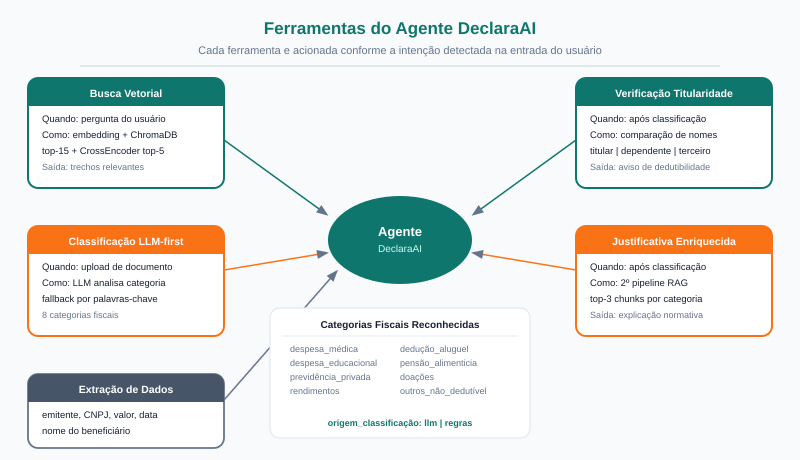
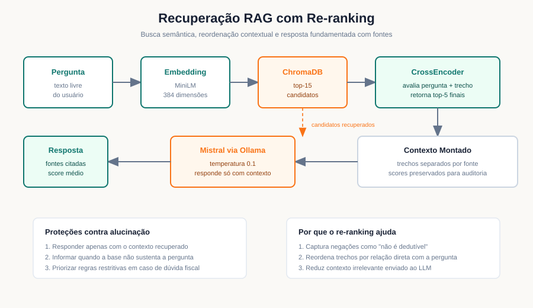
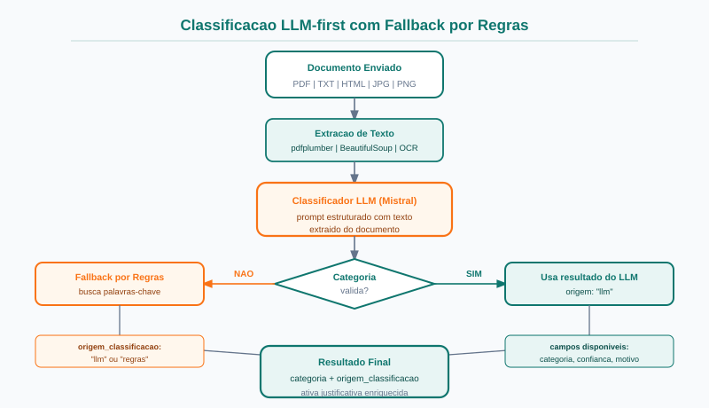
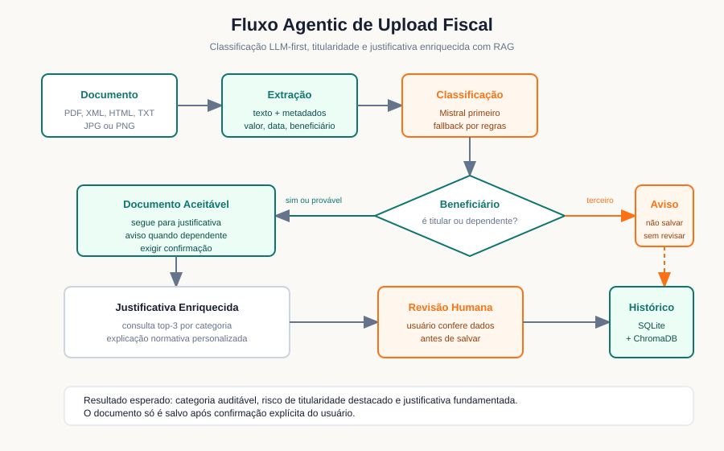
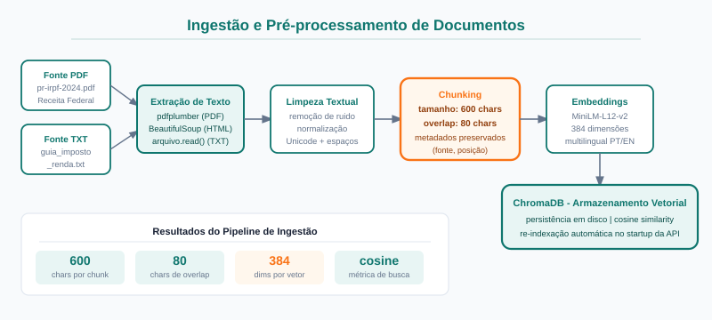
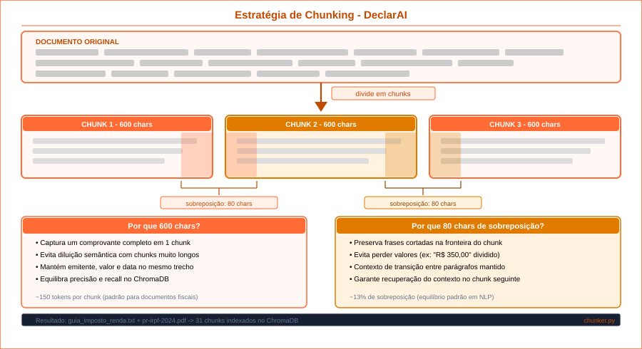
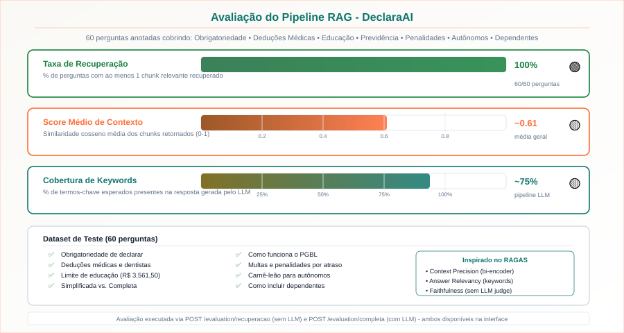

# Prompt para NotebookLM - Slides DeclarAI: Agentic RAG

Use este conteúdo como prompt para gerar uma apresentação profissional sobre o DeclarAI. A apresentação deve priorizar as melhorias implementadas desde a última entrega na branch `main`, destacando a evolução atual da branch `develop`.

Este PDF deve ser usado como briefing único para o NotebookLM. Ele contém contexto, problema, solução, roteiro de slides, padrão visual, diagramas existentes e regras de composição. Gere uma apresentação 16:9, profissional, clara, em português brasileiro e pronta para demonstração acadêmica.

## Objetivo do Slide Deck

Criar uma apresentação sobre o DeclarAI, um Micro SaaS acadêmico com Agentic RAG para apoiar a organização de documentos e dúvidas sobre a declaração do Imposto de Renda Pessoa Física no Brasil.

A apresentação deve convencer a banca de que o projeto atende aos requisitos da atividade, com foco em:

- problema real e domínio claramente delimitado;
- base de conhecimento própria;
- pipeline RAG com ingestão, chunking, embeddings, recuperação e re-ranking;
- comportamento Agentic RAG com ferramentas;
- LLM aberto via Ollama;
- interface web utilizável;
- avaliação quantitativa com dataset anotado;
- documentação, diagramas e demonstração ao vivo.

## Regras de Geração da Apresentação

- Gerar exatamente 16 slides.
- Usar formato widescreen 16:9.
- Usar português brasileiro com acentuação correta.
- Não criar informações, métricas, autores, endpoints ou tecnologias que não estejam neste PDF.
- Não usar conteúdo genérico de imposto de renda fora do contexto do projeto.
- Não transformar o DeclarAI em produto comercial real. Tratar como Micro SaaS acadêmico.
- Não dizer que o sistema substitui contador. Sempre posicionar como apoio informativo.
- Evitar blocos longos de texto. Preferir frases curtas, tabelas pequenas, diagramas e bullets objetivos.
- Cada slide deve ter título forte, mensagem principal e visual associado quando houver diagrama indicado.
- Não usar travessão. Use hífen simples quando precisar separar ideias.

## Direção Visual

- Todos os slides devem ter fundo off-white, preferencialmente `#FAF9F6`.
- Usar laranja `#F97316` para títulos, destaques e ícones principais.
- Usar amarelo dourado `#FBBF24` para badges, chamadas e divisores.
- Usar preto suave `#1A1A1A` e grafite `#172033` para textos.
- Usar verde-teal `#0F766E` apenas como cor de apoio para métricas e barras.
- Evitar fundo escuro, gradientes pesados, blocos poluídos e setas sobrepostas.
- Preferir diagramas simples, com muito respiro, cartões claros e tipografia sem serifa.
- Usar cartões apenas para informações comparáveis, métricas, etapas e componentes.
- Manter margens generosas e alinhamento consistente.
- Usar no máximo 5 bullets por slide.
- Quando houver diagrama, ele deve ser o elemento visual principal.
- Não colocar texto sobre diagramas de forma que prejudique leitura.

## Padrão de Títulos, Rodapé e Layout

- Título de slide: topo esquerdo, cor `#F97316`, peso alto, fonte de **50px**.
- Subtítulo ou frase guia: abaixo do título, cor `#172033`, fonte de 22px.
- Rodapé em todos os slides, exceto se a capa ficar visualmente melhor sem rodapé.
- Rodapé sugerido: `DeclarAI | UEA | Oficina e Desenvolvimento de Sistemas I | Junho de 2026`.
- Numeração discreta no canto inferior direito, formato `01/16`, `02/16` e assim por diante.
- Usar logotipo pequeno do DeclarAI no rodapé ou no canto superior direito.
- Capa: criar composição nova, limpa e institucional. Não usar `diagrams/cover_slide.svg` como layout principal.
- Capa deve usar o nome `DeclarAI` como elemento mais forte da primeira tela.
- A capa deve mostrar equipe, disciplina, instituição e data sem parecer pôster poluído.

## Banco Visual Disponível

Use os arquivos abaixo como referência visual. Ao montar os slides, incorpore os diagramas indicados nas seções de cada slide.

| Arquivo | Uso recomendado |
|---|---|
| `diagrams/logo.svg` | marca horizontal do DeclarAI |
| `diagrams/logo_icon.svg` | ícone pequeno para rodapé, capa ou detalhes |
| `diagrams/agentic_rag/c4_contexto.svg` | arquitetura em nível de contexto |
| `diagrams/agentic_rag/c4_containers.svg` | arquitetura de contêineres |
| `diagrams/agentic_rag/fluxo_agentico.svg` | decisão do agente por tipo de entrada |
| `diagrams/agentic_rag/ferramentas_agente.svg` | ferramentas do agente |
| `diagrams/agentic_rag/recuperacao_reranking.svg` | recuperação e re-ranking |
| `diagrams/agentic_rag/classificacao_llm_first.svg` | classificação LLM-first |
| `diagrams/agentic_rag/titularidade_justificativa.svg` | titularidade e justificativa |
| `diagrams/agentic_rag/pipeline_rag.svg` | pipeline RAG completo |
| `diagrams/agentic_rag/indexacao_e_ingestao.svg` | ingestão e pré-processamento |
| `diagrams/chunking_estrategia.svg` | estratégia de chunking |
| `diagrams/agentic_rag/avaliacao_rag.svg` | métricas de avaliação |
| `diagrams/cover_slide.svg` | capa antiga, usar apenas como referência de paleta se necessário |

## Contexto do Projeto

**Título geral:** DeclarAI: Agentic RAG para apoio à declaração do IRPF

**Instituição:** Universidade do Estado do Amazonas

**Disciplina:** Oficina e Desenvolvimento de Sistemas I

**Equipe:** Juliana Ballin Lima, 2315310011, e Fernando Luiz Da Silva Freire, 2315310007

**Data:** Junho de 2026

**Repositório:** apresentar a branch `develop`

## Contexto Técnico Sintético

O DeclarAI possui backend FastAPI, frontend React + Vite, banco SQLite para histórico, ChromaDB para vetores, embeddings com `sentence-transformers/paraphrase-multilingual-MiniLM-L12-v2`, re-ranking com `cross-encoder/mmarco-mMiniLMv2-L12-H384-v1` e LLM aberto `mistral` executado via Ollama.

O fluxo principal é:

```text
Usuário
  |
  + Frontend React
  |
  + API FastAPI
  |
  + Ferramentas do agente
      + Chat RAG
      + Upload fiscal
      + Classificação LLM-first
      + Verificação de titularidade
      + Justificativa RAG
      + Histórico SQLite
      + Avaliação do pipeline
```

## Problema, Solução e Valor

**Problema:** contribuintes leigos têm dificuldade para organizar documentos do IRPF, diferenciar despesas dedutíveis de não dedutíveis, separar titular, dependentes e terceiros, e entender regras fiscais com base em documentos confiáveis.

**Solução:** um assistente local com Agentic RAG que consulta uma base fiscal própria, processa documentos, classifica categorias tributárias, verifica titularidade e gera justificativas fundamentadas.

**Valor:** reduzir erros de organização, melhorar a revisão documental, preservar privacidade e facilitar a demonstração dos critérios técnicos da atividade.

## Slide 1: Capa

**Título:** DeclarAI

**Subtítulo:** Agentic RAG para apoio inteligente à declaração do IRPF

**Mensagem principal:** Micro SaaS acadêmico com LLM aberto, execução local, base de conhecimento fiscal e classificação automática de documentos.

**Visual sugerido:** fundo off-white, nome DeclarAI grande, logo pequeno, selo IRPF 2026 como detalhe visual, nomes dos integrantes e UEA no rodapé.

**Instrução de composição:** criar capa nova, sem reaproveitar a capa antiga. A capa deve parecer acadêmica, limpa e moderna, com foco no nome DeclarAI.

## Slide 2: Problema Real

**Título:** Por que o DeclarAI é necessário?

A declaração do IRPF exige que contribuintes organizem recibos, notas fiscais, informes e comprovantes ao longo do ano. Usuários que não são contadores costumam ter dificuldades para:

- identificar despesas dedutíveis;
- evitar despesas que a Receita Federal não aceita;
- separar documentos do titular, dependentes e terceiros;
- entender limites, regras e comprovantes necessários.

**Proposta de valor:** um assistente especializado no domínio fiscal brasileiro, com respostas fundamentadas em documentos de referência e processamento local de dados sensíveis.

## Slide 3: Arquitetura Geral

**Título:** Arquitetura do DeclarAI

Use um diagrama por camadas e destaque a execução local:

| Camada | Tecnologia | Papel |
|---|---|---|
| Frontend | React + Vite | Chat, upload, base, histórico, avaliação e status |
| API | FastAPI | Rotas REST, Swagger e orquestração dos serviços |
| RAG | MiniLM + ChromaDB | Indexação, embeddings e recuperação semântica |
| Re-ranking | CrossEncoder | Reordenação contextual dos trechos recuperados |
| LLM | Mistral via Ollama | Geração de respostas, classificação e justificativas |
| Persistência | SQLite + ChromaDB | Histórico de documentos e vetores |

**Diferencial:** execução local, sem envio de documentos fiscais para APIs externas.

**Por que apenas modelos locais (sem APIs de nuvem)?**

Documentos fiscais contem dados altamente sensiveis: CPF, renda anual, informacoes de saude, dependentes, valores de patrimonio. O envio desses dados para APIs externas (OpenAI, Gemini, Claude) representaria:

- Risco de violacao da LGPD (Lei Geral de Protecao de Dados);
- Dependencia de internet e disponibilidade de servico externo;
- Custo recorrente por token, inviavel para projeto academico;
- Perda de controle sobre como os dados sao usados e armazenados.

A execucao local via Ollama resolve todos esses pontos: os dados nunca saem do ambiente do usuario.

**Justificativa de cada modelo escolhido:**

| Modelo | Papel | Justificativa |
|---|---|---|
| Mistral (Ollama) | Geracao e classificacao | Licenca aberta, melhor cobertura no dominio fiscal (72,4%), bom suporte a PT-BR |
| MiniLM-L12-v2 (multilingual) | Embeddings | Leve, multilingue (suporta PT-BR), 384 dimensoes, compativel com CPU |
| CrossEncoder mmarco multilingual | Re-ranking | Re-ranqueamento multilingue, melhora qualidade em perguntas com negacoes fiscais |

**Diagramas disponíveis:**

- Contexto geral: `diagrams/agentic_rag/c4_contexto.svg`
- Contêineres: `diagrams/agentic_rag/c4_containers.svg`


## Slide 4: Agentic RAG

**Título:** O agente escolhe a ferramenta certa

Mostrar um diagrama de decisão:

```text
Entrada do usuário
  |
  + Pergunta sobre IRPF -> Chat RAG
  + Documento enviado -> Upload fiscal
  + Consulta de documentos -> Histórico SQLite
  + Avaliação -> Métricas do pipeline
```

**Ferramentas implementadas:**

1. Busca vetorial com ChromaDB.
2. Re-ranking com CrossEncoder.
3. Classificação LLM-first com fallback por regras.
4. Verificação de titularidade.
5. Justificativa enriquecida com segundo pipeline RAG.
6. Consulta ao histórico e resumo anual.

**Diagramas disponíveis:**

- Fluxo de decisão do agente: `diagrams/agentic_rag/fluxo_agentico.svg`
- Ferramentas do agente: `diagrams/agentic_rag/ferramentas_agente.svg`




## Slide 5: Melhoria 1 Desde a Main - Re-ranking

**Título:** Re-ranking semântico com CrossEncoder

**Antes:** a busca vetorial retornava trechos apenas por similaridade de embedding.

**Depois:** o ChromaDB recupera top-15 candidatos e o CrossEncoder reordena os pares pergunta + trecho, retornando os top-5 mais relevantes.

**Impacto técnico:**

- melhora perguntas com negações fiscais, como "não é dedutível";
- reduz contexto irrelevante enviado ao LLM;
- aumenta a confiança das fontes exibidas ao usuário.

**Arquivo principal:** `backend/app/rag/retriever.py`

**Diagrama:** `diagrams/agentic_rag/recuperacao_reranking.svg`



## Slide 6: Melhoria 2 Desde a Main - Classificação LLM-first

**Título:** Classificação mais flexível de documentos fiscais

**Antes:** classificação por palavras-chave fixas.

**Depois:** o Mistral tenta classificar primeiro. Se o resultado for inválido ou incerto, o sistema usa fallback por regras.

Fluxo:

```text
Texto extraído
  |
  + Mistral classifica categoria
  |
  + Categoria válida? sim -> origem_classificacao = llm
  |
  + Categoria válida? não -> fallback por regras
```

Categorias reconhecidas:

- `despesa_medica`
- `despesa_educacional`
- `previdencia_privada`
- `rendimentos`
- `deducao_aluguel`
- `pensao_alimenticia`
- `doacoes`
- `outros_nao_dedutivel`

**Por que usar LLM para classificacao?**

A classificacao por palavras-chave fixas falha em documentos com linguagem informal, abreviacoes medicas ou termos regionais. O LLM interpreta o contexto completo do documento, reduzindo falsos negativos e permitindo identificar categorias ambiguas. O fallback por regras garante seguranca quando o Ollama nao esta disponivel.

**Como o Mistral foi selecionado para classificacao?**

Foram avaliados quatro modelos locais via Ollama no dataset de 60 perguntas do dominio IRPF:

| Modelo | Cobertura (%) | Latencia (s) |
|---|---|---|
| Mistral + RAG | 72,4 | 8,2 |
| Phi-4 Mini + RAG | 68,3 | 7,0 |
| Llama 3.2:3b + RAG | 65,8 | 6,4 |
| Gemma 3:4b + RAG | 61,2 | 6,9 |

O Mistral foi escolhido por apresentar a maior cobertura de palavras-chave esperadas (72,4%) e bom suporte ao portugues brasileiro, com custo computacional compativel com CPUs comuns. Os demais modelos foram descartados por cobertura inferior no dominio fiscal.

**Diagrama:** `diagrams/agentic_rag/classificacao_llm_first.svg`



## Slide 7: Melhoria 3 Desde a Main - Titularidade

**Título:** Verificação de titular, dependente ou terceiro

**Problema resolvido:** despesas de terceiros não dependentes não são dedutíveis, mesmo quando foram pagas pelo declarante.

**Implementação:**

- `POST /declarante/perfil` registra nome e CPF do declarante.
- `POST /declarante/verificar-titularidade` compara beneficiário e declarante.
- O frontend agora exibe o resultado na tela de upload.

Estados possíveis:

| Resultado | Ação recomendada |
|---|---|
| Titular | Documento pode seguir para revisão |
| Dependente provável | Usuário deve confirmar vínculo |
| Terceiro | Sistema exibe alerta antes de salvar |

**Diagrama:** `diagrams/agentic_rag/titularidade_justificativa.svg`



## Slide 8: Melhoria 4 Desde a Main - Justificativa RAG

**Título:** Justificativa enriquecida com base de conhecimento

**Antes:** justificativas estáticas e genéricas.

**Depois:** após a classificação, o sistema consulta a base por categoria, recupera os top-3 trechos e gera uma justificativa curta com Mistral.

**Dados usados no prompt:**

- categoria tributária;
- tipo do documento;
- emitente;
- beneficiário;
- valor;
- situação no IRPF;
- trechos recuperados da base.

**Impacto:** o usuário entende por que o documento recebeu aquela categoria e quais cuidados precisa verificar.

**Diagrama completo do pipeline:** `diagrams/agentic_rag/pipeline_rag.svg`


## Slide 9: Melhoria 5 Desde a Main - Frontend

**Título:** Interface React mais completa

Páginas funcionais:

- **Chat RAG:** sugestões, fontes consultadas, quantidade de chunks e score médio.
- **Upload Fiscal:** drag-and-drop, extração, classificação, titularidade e salvamento revisado.
- **Base de Conhecimento:** adicionar, remover e re-indexar documentos.
- **Histórico:** filtros, exclusão, agrupamento por categoria e resumo anual.
- **Avaliação:** métricas de recuperação, avaliação completa e comparação de modelos.
- **Status:** Ollama, modelos, chunks e estado do pipeline.

**Mensagem visual:** mostrar a interface como hub do sistema. Usar cartões ou uma grade de páginas com ícones.

## Slide 10: Base de Conhecimento

**Título:** Documentos próprios e relevantes ao domínio

| Arquivo | Tipo | Relevância |
|---|---|---|
| `guia_imposto_renda.txt` | TXT | Regras resumidas de obrigatoriedade, deduções e documentos |
| `pr-irpf-2024.pdf` | PDF | Perguntas e respostas oficiais da Receita Federal |

Explique que os documentos foram escolhidos por cobrirem dúvidas recorrentes sobre despesas médicas, educação, previdência privada, rendimentos, dependentes, aluguéis, prazos, penalidades e documentos fiscais.

**Pipeline de ingestão:**

```text
Carregamento -> limpeza textual -> chunking 600/80 -> embeddings MiniLM -> ChromaDB
```

A base pode ser ampliada pela interface, e a re-indexação aceita diferentes configurações para experimentos.

**Por que chunk_size=600 e overlap=80?**

Foram desenhadas e testadas 7 configuracoes via `scripts/avaliar_chunking.py`, avaliadas no dataset de perguntas do dominio IRPF:

| Configuracao | chunk_size | overlap | Observacao |
|---|---|---|---|
| fixo_200_0 | 200 | 0 | Trechos curtos, perda de contexto fiscal |
| fixo_400_40 | 400 | 40 | Equilibrio fraco, sobreposicao insuficiente |
| **fixo_600_80** | **600** | **80** | **Melhor equilibrio contexto x precisao** |
| fixo_800_120 | 800 | 120 | Contexto rico, mas maior ruido semantico |
| fixo_1000_200 | 1000 | 200 | Trechos longos demais para o modelo de embedding |
| sentenca | variavel | 0 | Fragmentos irregulares em documentos fiscais |
| semantico | variavel | variavel | Experimental, sem vantagem clara no dominio |

A configuracao 600/80 foi selecionada por preservar regras fiscais completas (paragrafos com limites e excecoes) sem gerar trechos longos demais que diluem a similaridade semantica.

**Diagramas disponíveis:**

- Ingestão e pré-processamento: `diagrams/agentic_rag/indexacao_e_ingestao.svg`
- Estratégia de chunking: `diagrams/chunking_estrategia.svg`





## Slide 11: Avaliação Quantitativa

**Título:** Como a qualidade foi medida

Dataset: `data/eval/perguntas.json`

- 60 perguntas anotadas.
- 12 categorias fiscais.
- 3 níveis de dificuldade.
- Cada pergunta possui resposta de referência e palavras-chave esperadas.

Métricas:

| Métrica | Objetivo |
|---|---|
| Taxa de recuperação | medir perguntas com ao menos um chunk recuperado |
| Score médio de contexto | medir similaridade dos chunks retornados |
| Cobertura de keywords | medir termos esperados na resposta |
| Latência por pergunta | medir tempo total do pipeline |

Também existe avaliação completa pela interface, usando `POST /evaluation/completa`, que executa recuperação e geração via LLM local. A avaliação de recuperação usa `POST /evaluation/recuperacao` e não exige Ollama.

**Diagrama:** `diagrams/agentic_rag/avaliacao_rag.svg`



## Slide 12: Resultados de Modelos

**Título:** Mistral + RAG teve melhor cobertura

| Modelo | Cobertura | Latência média | Observação |
|---|---|---|---|
| Mistral + RAG | 72,4% | 8,2 s | Melhor cobertura |
| Phi4-mini + RAG | 68,3% | 7,0 s | Bom custo-benefício |
| Llama 3.2 3B + RAG | 65,8% | 6,4 s | Mais rápido |
| Gemma 3 4B + RAG | 61,2% | 6,9 s | Menor cobertura |
| Mistral sem RAG | 44,1% | 5,1 s | Linha de base |

**Conclusão:** o RAG acrescenta +28,3 pontos percentuais ao Mistral em comparação com o LLM sem recuperação.

## Slide 13: Ablation Study

**Título:** Por que o RAG faz diferença

Explique que o domínio fiscal depende de regras específicas, limites anuais, exceções e documentos oficiais. O LLM sem contexto tende a responder de forma genérica, enquanto o RAG injeta trechos recuperados da base própria.

Pontos-chave:

- limites fiscais mudam por exercício;
- regras de dedutibilidade têm exceções;
- a base oficial reduz alucinações;
- fontes e scores tornam a resposta auditável.

## Slide 14: Conformidade com a Atividade

**Título:** Requisitos técnicos atendidos

| Critério | Status |
|---|---|
| Problema e domínio | IRPF, público-alvo e relevância definidos |
| Base própria | TXT fiscal e PDF oficial da Receita Federal |
| Ingestão e pré-processamento | loader, limpeza, metadados e chunking |
| Embeddings e recuperação | MiniLM, ChromaDB e CrossEncoder |
| Agentic RAG | ferramentas acionadas por intenção |
| LLM aberto | Mistral via Ollama |
| Interface | React + FastAPI + Swagger |
| Avaliação | dataset, scripts e métricas |
| Documentação | README, relatório, diagramas e slides |

**Mensagem principal:** o projeto cobre todos os requisitos técnicos obrigatórios e os critérios de documentação, avaliação e demonstração.

## Slide 15: Limitações e Próximos Passos

**Título:** Limitações conhecidas

- Depende do Ollama instalado e do modelo baixado.
- Regras fiscais exigem atualização anual da base.
- OCR pode falhar em imagens ruins.
- A classificação ainda exige revisão humana.
- O sistema apoia o contribuinte, mas não substitui contador.

**Próximos passos:**

- busca híbrida BM25 + vetorial;
- comparação de embeddings;
- chunking semântico;
- base atualizada para o exercício fiscal vigente;
- dataset anotado de documentos enviados.

## Slide 16: Demonstração ao Vivo

**Título:** Roteiro da apresentação

1. Abrir o frontend em `http://localhost:3000`.
2. Mostrar status do sistema e disponibilidade do Ollama.
3. No chat, perguntar: "Curso de inglês é dedutível como educação?"
4. Mostrar fontes consultadas, score e resposta restritiva.
5. Enviar recibo médico de exemplo na tela de upload.
6. Mostrar extração, classificação, titularidade e justificativa.
7. Salvar o documento após revisão.
8. Abrir histórico e mostrar resumo anual.
9. Executar avaliação de recuperação ao vivo e mostrar a opção de avaliação completa.
10. Abrir Swagger em `http://localhost:8000/docs`.

## Encerramento

Concluir destacando que o DeclarAI evoluiu de um RAG básico para um Micro SaaS com comportamento agentic, avaliação quantitativa, interface utilizável, privacidade local e documentação completa.

## Checklist Final para o NotebookLM

Antes de finalizar a apresentação, verificar:

- todos os slides têm título padronizado;
- todos os slides estão em português brasileiro;
- a capa usa composição nova e não a capa antiga;
- o rodapé aparece de forma discreta e consistente;
- os diagramas estão legíveis e sem sobreposição;
- as cores seguem a paleta definida;
- as métricas são exatamente as informadas neste PDF;
- os endpoints e tecnologias não foram alterados;
- o sistema é descrito como apoio informativo, não como substituto de contador;
- a apresentação fecha com roteiro de demonstração ao vivo.
